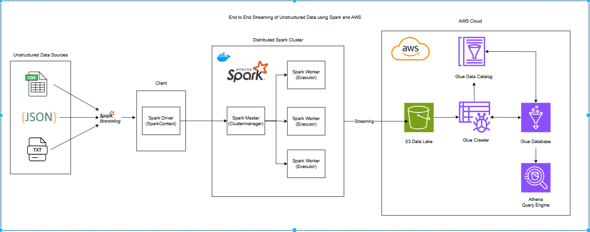

# Unstructured Data Streaming and Processing using Spark and AWS
- This is a data engineering project which leverages the power of Spark streaming to stream unstructured data, process it and then load it in AWS Glue database which is later queried using AWS Athena
- The unstructured data are present in form of CSV files, JSON files and txt files.
- Parsing is done in txt files using regex to extract required fields as per the schema of destination table
- The parsed and processed data is firstly stored in AWS S3 data lake in form of parquet files.
- Then using AWS Glue crawler, a glue data catalog is created and then data is loaded to AWS Glue database
- Finally we analyze the tables stored in this AWS Glue database using AWS Athena

So overall pipeline involves:  
Local unstructured Files -> Spark Streaming -> S3 Data lake -> Glue Crawler -> Glue data catalog and Glue tables -> AWS Athena

## Architecture


## Setup Project
1. Create new venv
```
python -m venv .udsa_env
```

2. Install requirements
```
pip install -r requirements.txt
```

3. Run the Script
```
spark-submit main.py
```

Using docker spark master
```
docker exec -it docker_setup-spark-master-1 spark-submit --master spark://spark-master:7077 jobs/main.py
```